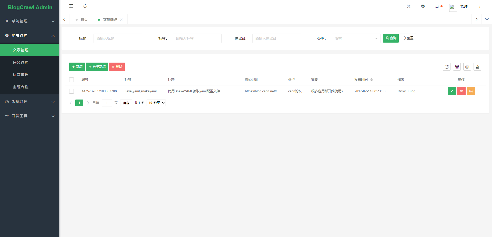
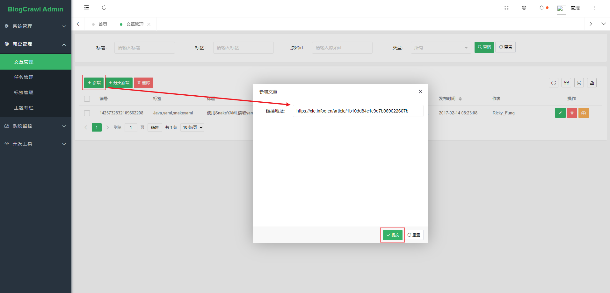
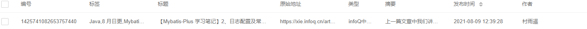
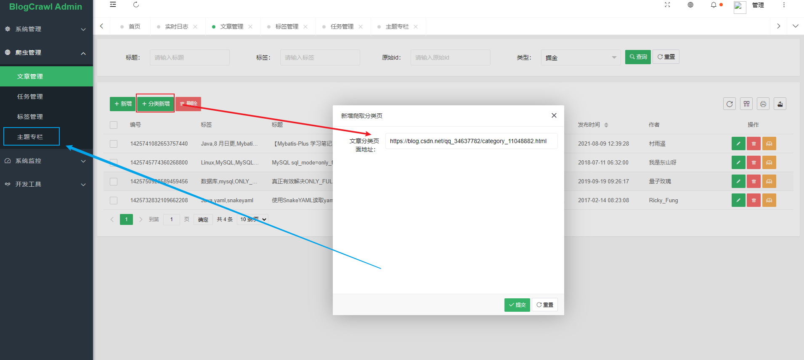
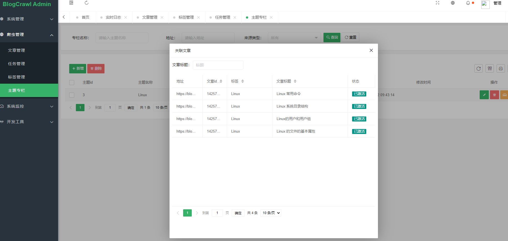
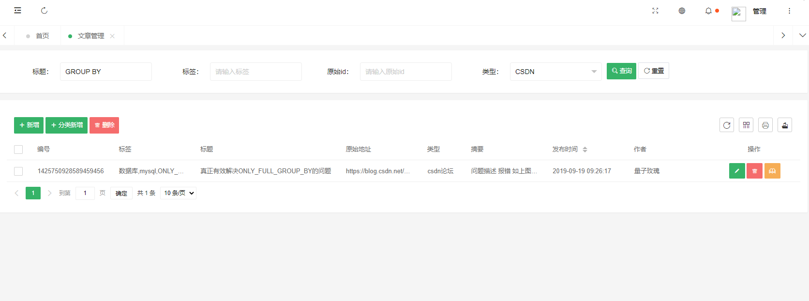
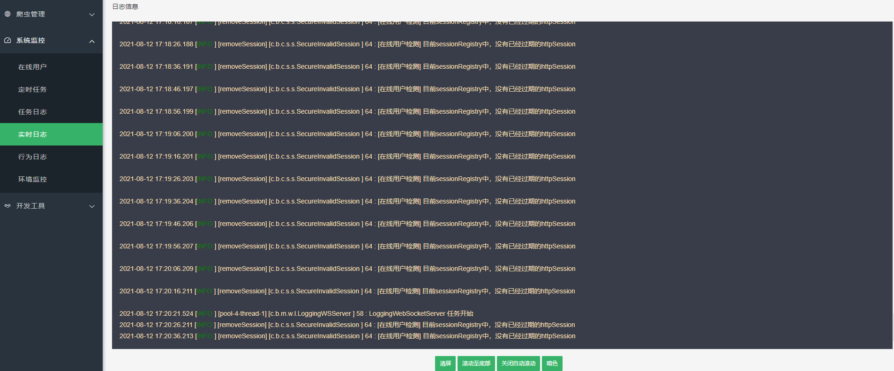
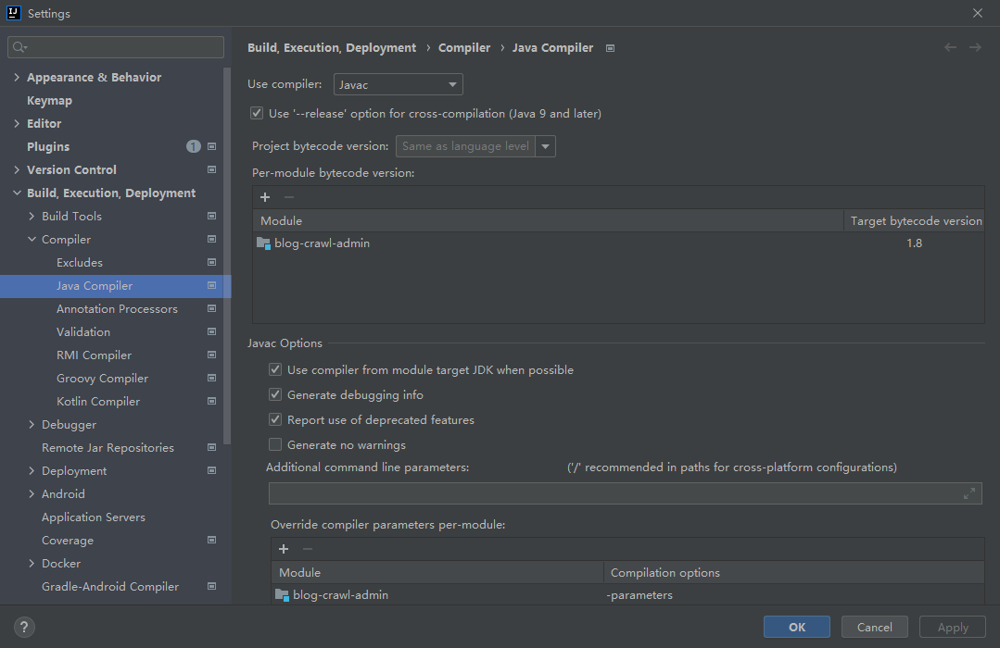
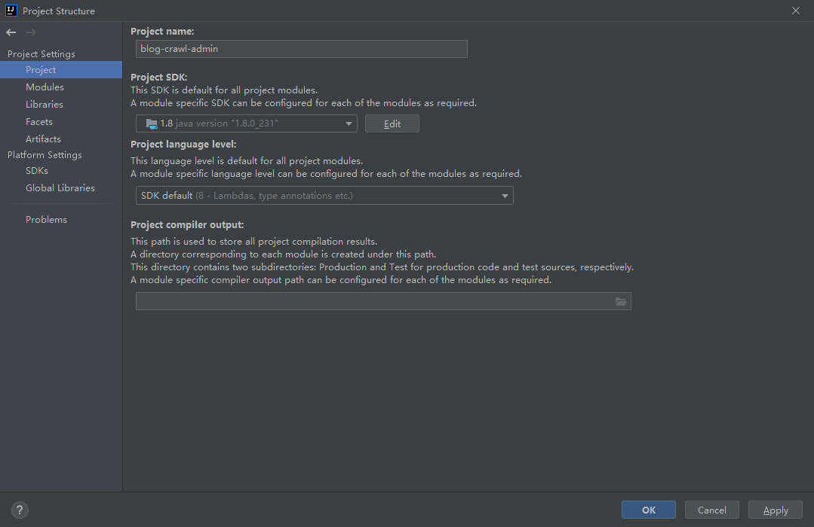

<h1 align="center">BlogCrawlAdmin</h1>

<h6 align="center">博客爬虫管理</h6>


`BlogCrawlAdmin`（博客爬虫管理） 是一个后台爬取文章管理项目😜，基于[Pear-Admin](https://gitee.com/pear-admin/Pear-Admin-Layui)框架开发。主要用于爬取某渠道文章，并统一解析成MD，管理爬取的文章；本项目不包含分布式采集、重爬、代理、多线程等逻辑，需要者自行开发。

本项目仅供学习使用，禁止用于任何非法用途！


## 1️⃣技术框架

```
SpringBoot：springboot全家桶

SpringSecurity：安全组件

Thymeleaf：模板引擎

TkMybatis：orm层

Druid：数据源连接池和监控

Sharding-Jdbc：分库分表

MySQL：数据存储

Redis：分布式存储

Quartz：定时任务框架

Lucene：搜索引擎

Jsoup：解析Document

Websocket：集成web-socket

Selenium：自动化测试工具

LayUI：前端框架


```

**主要模块`spider`目录**

[在WebIDE中打开项目](https://github1s.com/xu-ux/blog-crawl-admin)

```shell
.
|-- controller # 视图层
|-- domain # 实体模型
|-- enums # 枚举
|-- http # http工具
|-- manager # 业务层
|-- mapper # ORM
|-- pojo # 传输实体
|-- service # 服务层
`-- util # 工具

```

#### 主要实现的功能：

1. 各种渠道的博客文章爬取
2. 内置搜索引擎，检索已爬取的文章
3. 文章转换成markdown
4. 解析原文中的图片，存到本地或者阿里云OSS
5. 文章修改编辑和预览


#### 目前可以Copy的文章渠道有：

~~CSDN~~

~~掘金~~

~~博客园~~

~~INFOQ~~(动态)

~~微信公众号文章~~(动态)

~~简书~~

~~思否~~

......


## 2️⃣效果展示

爬虫内容管理界面：



提交爬取的文章地址：



得到文章：



文章实际效果：


根据CSDN收藏夹地址新增多篇文章



效果展示：




通过lucene搜索引擎搜索：




**其他功能**

实时日志：




## 3️⃣快速启动


### 3.1 准备

1. 克隆工程
2. 使用IDEA打开
3. 导入sql文件`blog-crawl.sql`至指定库中（请使用utf8mb4）
4. 修改相关配置


### 3.2 修改配置


**1.修改编译环境为jdk1.8**






**2.修改数据源和Redis**

修改`application-dev.yml`文件中的数据库连接地址和账号密码：

```yaml
      ds0:
        type: com.alibaba.druid.pool.DruidDataSource
        url: #YourMySqlConnectUrl
        username: #YourMySqlUserName
        password: #YourMySqlPassword
```

修改`redis`连接账号和密码：

```yaml
spring:
  redis:
    # 主 机 地 址
    host: #YourRedisHost
    # 端 口
    port: #YourRedisPort
    # 认 证
    password:  #YourRedisPassword
    # 选 择 数 据 库
    database: 0 #ChoseDB
```


**3.修改oss**

**如果有需要将图片转存至阿里云oss的需求(默认只存本地)**

请修改`common-config.yml`

```yaml
########### oss配置
aliyunOss:
  ......
  publicBucketName: x***v #修改为阿里云账号的存储桶名称
  accessKeyId: L********************x #修改为阿里云账号的accessKey
  accessKeySecret: e********************u #修改为阿里云账号的accessKeySecret


########### 系统开关
appSwitch:
  uploadOss: true # 修改是否将图片上传给阿里云为true，默认false
```


**4.设置`selenium`**

若要爬取更多渠道文章，需要先配置好`selenium`，下载好对应`chrome`版本的`driver`放入`resources/driver/`下

>chromedriver各版本下载地址：
>https://chromedriver.storage.googleapis.com/index.html


### 3.3 启动问题


#### 3.3.1. 需关闭MySQL的ONLY_FULL_GROUP_BY

推荐文章：https://blog.csdn.net/qq_34637782/article/details/101029487


## 4️⃣发布声明

请勿将`BlogCrawlAdmin`应用到任何可能会违反法律规定和道德约束的工作中，请友善使用`BlogCrawlAdmin`，遵守相关协议，不要将`BlogCrawlAdmin`用于任何非法用途。如您选择使用`BlogCrawlAdmin`即代表您遵守此协议，作者不承担任何由于您违反此协议带来任何的法律风险和损失，一切后果由您承担。
